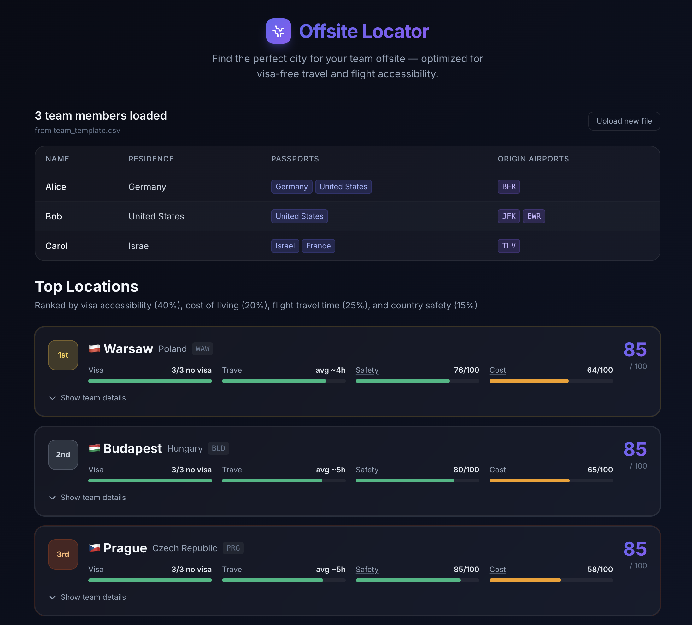

# Offsite Locator

A pure frontend SPA that ranks ~60 candidate cities for a team offsite based on visa accessibility, travel time, country safety, and cost of living. No backend, no auth, no API keys required — all data is fetched from free public sources at runtime.



## Quick Start

```bash
npm install
npm run dev
```

## How It Works

1. **Upload your team CSV** — list team members with their passports, residence, and nearest airports.
2. **Review the team table** — confirm the parsed data looks correct.
3. **Get ranked results** — cities are scored and ranked; expand any city to see per-member visa and travel details.

### Team CSV Format

Download the [template](public/team_template.csv) or create your own:

```csv
name,residence,citizenships,airports
Alice,Germany,Germany;United States,BER
Bob,United States,United States,JFK;EWR
Carol,Israel,Israel;France,TLV
```

- `name` — team member name
- `residence` — country of residence (full English name, e.g. `Germany`)
- `citizenships` — semicolon-separated list of passports (full English names)
- `airports` — semicolon-separated list of nearest IATA airport codes

## Scoring

Cities are ranked by a weighted combined score:

| Factor | Weight | Source |
|---|---|---|
| Visa accessibility | 40% | [passport-index-data](https://github.com/imorte/passport-index-data) |
| Travel time | 25% | [OurAirports](https://github.com/davidmegginson/ourairports-data) + [OpenFlights routes](https://github.com/jpatokal/openflights) |
| Country safety | 15% | World Bank PV.EST indicator |
| Cost of living | 20% | World Bank price level ratio |

**Visa score** counts members with free/easy access (visa-free, eTA, visa on arrival, citizen, resident) vs. those who face barriers (e-visa, visa required). e-visas are treated as barriers since no free database encodes their cost or processing time.

**Travel score** estimates door-to-door hours via the flight route graph, accounting for layovers. Lower average hours = higher score.

## Tech Stack

- Vite + React 18
- Tailwind CSS v3
- papaparse (CSV parsing)

All external data is fetched and cached in-session on first load — no build step needed to update data.
